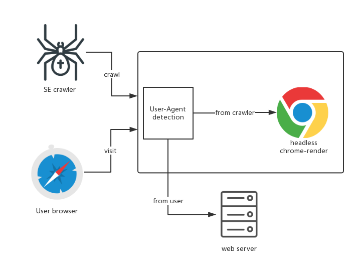

[](https://www.npmjs.com/package/express-middleware-seo)
[](https://www.npmjs.com/package/express-middleware-seo)
[](https://npmjs.org/package/express-middleware-seo)
[](https://travis-ci.org/Binaryify/express-middleware-seo#)

# express-middleware-seo
SEO middleware for express base on [chrome-render](https://github.com/gwuhaolin/chrome-render), a substitute for [prerender](https://prerender.io).

Modern web app use technique like react.js vue.js which render html in browser, this lead to search engine can't crawl your page content.

This project want to solve this kind of problem in a general-purpose way, it detect request is from search engine crawler then use headless chrome to render out your modern web page and return to crawler.

Here is express-middleware-seo's architecture diagram:


## Use
```bash
npm i express-middleware-seo
```
then use it:
```js
const express = require('express')
const path = require('path')
const app = express()
const { seoMiddleware } = require('express-middleware-seo')

app.use(
  seoMiddleware({
    enable: true,
    render: {
      useReady: true,
      renderTimeout: 10000
    }
  })
)

app.use(express.static(__dirname + '/static'))

app.listen(3000)
```
you can download and run this [complete demo](./example)

## Notice
You should install Chrome 59+ in your servers before you use this middleware

## Options
options come form [chrome-render](https://github.com/gwuhaolin/chrome-render#chromerendernew-method-support-options)
- `maxTab`: `number` max tab chrome will open to render pages, default is no limit, `maxTab` used to avoid open to many tab lead to chrome crash. `ChromeRender` will create a tab poll to reuse tab for performance improve and resource reduce as open and close tab in chrome require time, like database connection poll. 
- `renderTimeout`: `number` in ms, `chromeRender.render()` will throw error if html string can't be resolved after `renderTimeout`, default is 5000ms.
- `useReady`: `boolean` whether use `window.isPageReady=1` to notify chrome-render page has ready. default is false chrome-render use `domContentEventFired` as page has ready.
- `script`: `string` is an option param. inject script source to evaluate when page on load

## Friends
- [chrome-render](https://github.com/gwuhaolin/chrome-render) general server render base on chrome.
- [chrome-pool](https://github.com/gwuhaolin/chrome-pool) Headless chrome tabs manage pool.
- [koa-chrome-render](https://github.com/gwuhaolin/koa-chrome-render) chrome-render middleware for koa
- [koa-seo](https://github.com/gwuhaolin/koa-seo) koa SEO middleware